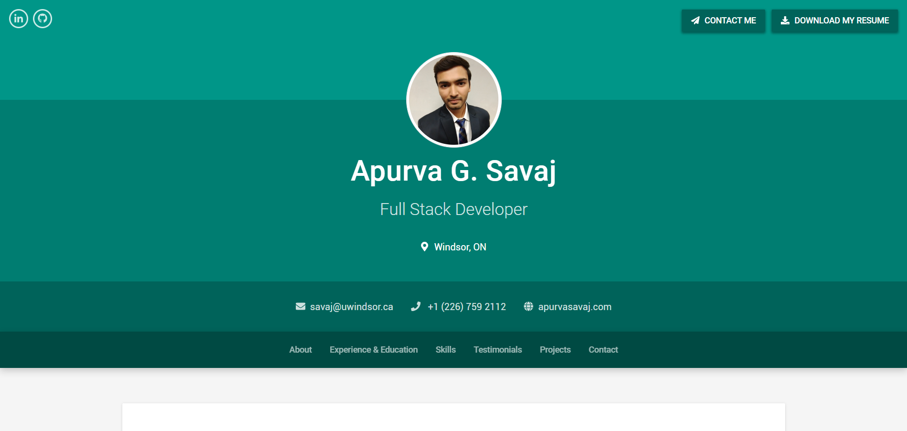

# Personal Portfolio

Sources of my personal portfolio.
React, React Router 4, Redux, Bootstrap 4

Preview:
www.apurvasavaj.com



---

## Quick Start

```bash
# clone repository
https://github.com/savajapurva/DevsNetwork-MERN.git

# Install dependencies
cd DevsNetwork-MERN && npm install

```
To run the development server:

```bash
# the development server runs on port 3000
npm start
```

To run production build:

```bash
# create code bundle
npm run build

# run production server
npm run prod
```

### To deploy this project to heroku see steps below:

You will need to install the [heroku-cli](https://devcenter.heroku.com/articles/heroku-cli)

```bash
# Heroku-cli (paste link in browser)
https://devcenter.heroku.com/articles/heroku-cli
```

Afer installing heroku-cli run the following commands in terminal

```bash
# login locally
heroku login
```

You will be prompted to enter your email and password which is the same the email and password used when you sign up for Heroku

```bash
# create your app
heroku create

```

Try to keep your production DB different from development DB

```bash
# bundle code for production
npm run build

# deploy code to heroku
git push heroku master:master
```


---


---


---


---

## Main Technologies

### Client Side

- [x] **[React](https://github.com/facebook/react)**
- [x] **[Redux](https://github.com/reactjs/redux)**
- [x] **[Bootstap 4](https://github.com/twbs/bootstrap/tree/v4-dev)**
- [x] **[Reactstrap](https://github.com/reactstrap/reactstrap)**
- [x] **[React-Router-DOM](https://github.com/ReactTraining/react-router/tree/master/packages/react-router-dom)**

#### Libraries used in Client-side

- [x] **[axios](https://github.com/axios/axios)**
- [x] **[classnames](https://github.com/JedWatson/classnames)**
- [x] **[react-moment](https://github.com/headzoo/react-moment)**
- [x] **[react-redux](https://github.com/reduxjs/react-redux)**
- [x] **[redux-thunk](https://github.com/reduxjs/redux-thunk)**
- [x] **[react-stickynode](https://github.com/yahoo/react-stickynode)**
- [x] **[react-scroll](https://github.com/fisshy/react-scroll)**
- [x] **[react-animations](https://github.com/FormidableLabs/react-animations)**
- [x] **[prop-types](https://github.com/facebook/prop-types)**

### Server Side

- [x] **[Node.js / Express](https://github.com/expressjs/express)**
- [x] **[path](https://github.com/nodejs/node)**
